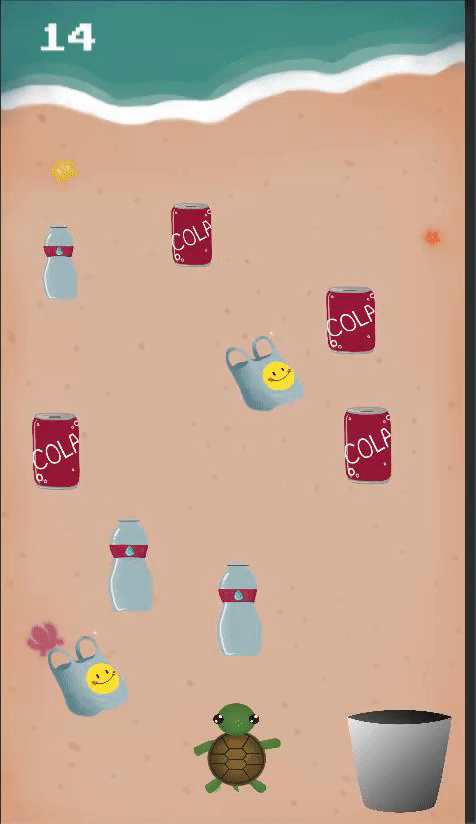
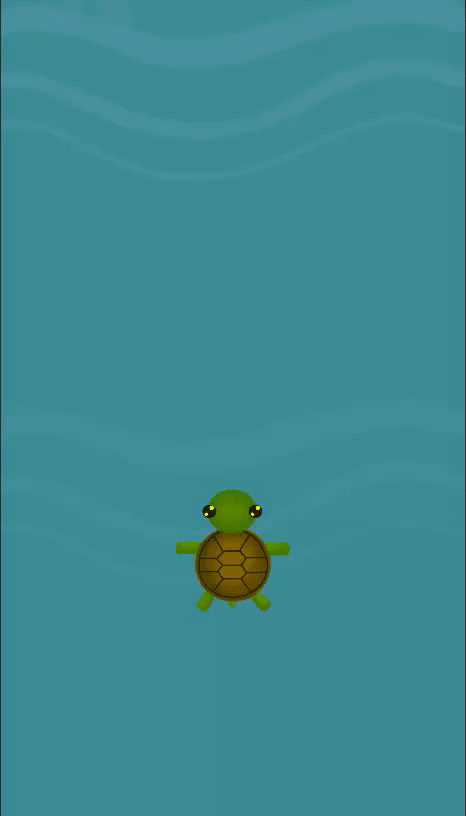
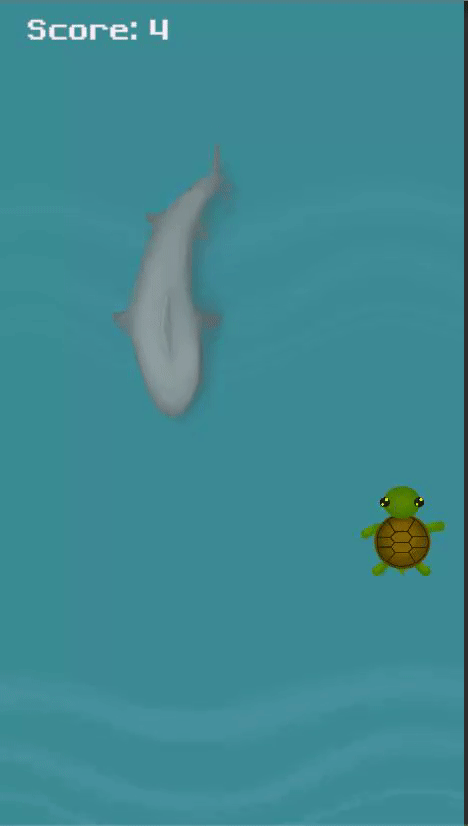

# TurtleRescue

## Overview
Turtle Rescue is a mobile game designed to illustrate the damaging effects of climate change on marine life and beaches. The user plays as a newborn turtle, attempting to navigate a beach and ocean ravaged by climate change. The game is designed to be able to be run on Android and iOS as well. 

## Demonstration 
### Level 1
In Level 1, the user clears a path for the turtle by dragging and dropping pieces of litter from the beach into the trash can. The turtle moves forward with each step, and reaches the ocean once all litter has been cleared. 

### Level 2
In Level 2, the user is challenged to differentiate between jellyfish and plastic bags carelessly tossed into the ocean. Both appear similar to sea turtles. However, while jellyfish is considered prey, getting caught in and/or eating plastic bags are life threatening to turtles.

The user will also need to dodge sharks by using their device's accelerometer. Shark bites are devastating to turtles which is why turtles try to avoid them but climate change has affected sea temperatures and migration cycles of sharks resulting in unfortunate meetings. 

### Future Levels
Future levels that are being worked on will show how else the effects of global warming and pollution affect the lives of sea turtles in more phases of their life.

### How to help the environment out
After passing each level, the user can redirect to a page of nonprofit organizations dedicated towards preserving marine life. Clicking on each charity icon will redirect the user to the organization's website, listing ways a user can volunteer or donate. 

## Tech used
Built with Unity and C#

## Future improvements
One goal would be to reorganize the charity pages. Our current design is text-heavy and cluttered. 
We would plan on making the animations more fluid (of the turtle avatar in levels 1 and 2), especially in terms of different animations of the turtle for when the turtle is swimming vs when it is walking. We also want to implement animations for the swimming sharks, jellyfish, and plastic bag in level 2.
